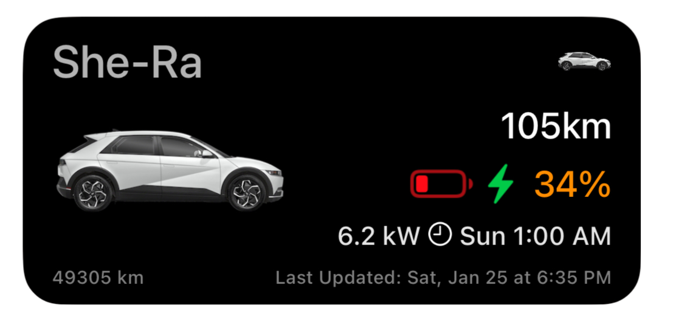

# Hyundai / Kia E-GMP scriptable app for IOS
{: .fs-8 }

A [scriptable app](https://scriptable.app/) for IOS that allows you to control your Hyundai / Kia electric car using the Bluelink API. 
{: .fs-6 .fw-300 }

  
  <video id="VisaChipCardVideo" height="680" autoplay controls>
      <source src="./images/egmp-scriptable-in-use.mp4" type="video/mp4">
      <!--Browser does not support <video> tag -->
    </video>

<table border="0" class="noBorder">
<tr>
<td width="55%">
 
Click to show app in action

</td>
<td>

<a href="./pages/install" class="btn btn-primary fs-5 mb-4 mb-md-0 mr-2">Install Instructions</a>

<a href="https://github.com/andyfase/egmp-bluelink-scriptable" class="btn fs-5 mb-4 mb-md-0">View it on GitHub&#160;&#160;</a>

</td>
</tr>
</table>

Features Include:
{: .fs-6 .fw-300 }

- Auto-Updating Homescreen and Lockscreen Widgets
- Fresh and more responsive app UI
- Single click options for common commands (lock, warm, charge etc) in both app and in IOS Control Center
- Siri voice support "Hey Siri, Warm the car"
- Automations via IOS Shortcuts like walk-away lock
- Unlimited Custom Climate configurations 
{: .fs-6 .fw-300 }
