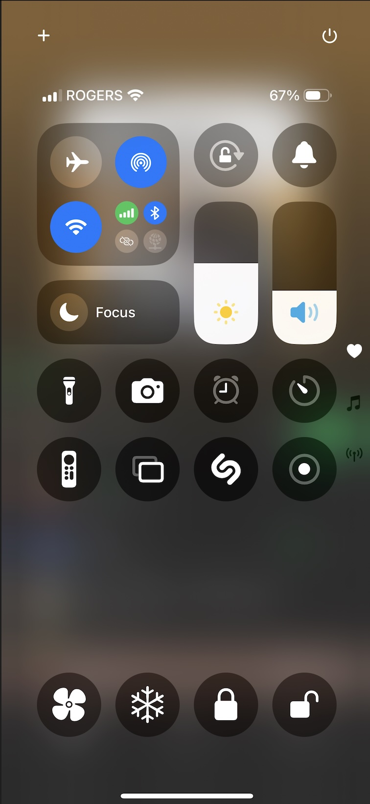

# Control Center Support
{: .fs-9 }

Once you have installed the common shortcuts listed in the [Siri](./siri.md) page. Those common shortcuts (lock, unlock, warm, cool) can be configured as single click icons on the [IOS Control Center](https://support.apple.com/en-ca/guide/iphone/iph59095ec58/ios).
{: .fs-5 .fw-300 }

When setup the bottom 4 controls will be available as per the screenshot below:
{: .fs-5 .fw-300 }

## Setup

To setup these contols follow the [Apple Instructions](https://support.apple.com/en-ca/guide/iphone/iph59095ec58/ios) "Customize controls" section.
{: .fs-5 .fw-300 }

- Choose "Add a Control"
- Search for and choose "Shortcut"
- Choose one of the common shortcuts installed from the [Siri](./siri.md) page
- Resize the control to a small circle - which will automatically show the correct icon
{: .fs-5 .fw-300 }

Repeat the above for all 4 controls.
{: .fs-5 .fw-300 }

