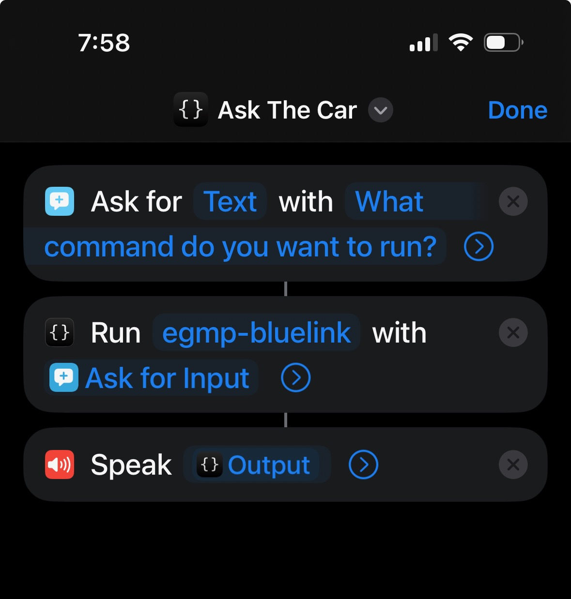

# Siri / Shortcuts Support
{: .fs-9 }

The app supports direct Siri interaction and IOS automations via the "Shortcuts" IOS app. The app can be passed a text string either directly through a shortcut, or through speech-to-text from Siri and then process commands based on keywords within the text string.
{: .fs-5 .fw-300 }

## Commands

The app supports the following keywords:

### "Status"

This will return the latest status of the car from the Bluelink API. Typically this will be a sentence stating charge status, if the car is locked and if the car is charging (and if it is when it will finish charging).

### "Remote Status"

This will issue a remote status command to the car to get the latest updated information. Once issued a normal status command will need to be issued approx 30 seconds later to retrieve this information

### "Lock"

This will issue a remote lock command to the car

### "Unlock"

This will issue a remote un-lock command to the car

### "Cool"

This will issue a remote command to pre-cool the car.

### "Warm"

This will issue a remote command to pre-heat the car.

### "Climate off"

This will issue a remote command to stop the climate controls in the car.

### "Start charging"

This will issue a remote command to start charging the car.

### "Stop charging"

This will issue a remote command to stop charging the car.
 
## Example Shortcut

 The below screenshot shows a basic Siri Shortcut that prompts for a command and then sends that text to the app.This can be used like:
 {: .fs-5 .fw-300 }

**User**: "Hey Siri, Ask the car"

**Siri**: "Whats the command?"

**User**: "Give me the status of the car"

**Siri**: "Ok, done. Your Ioniq 5's battery is at 75% and locked. Your car is also charging at 6kw and will be finished at 9pm"

