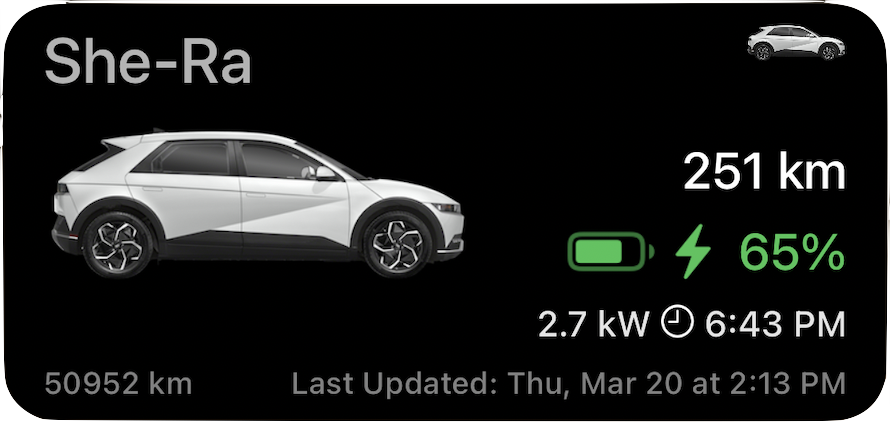

# Widget Support
{: .fs-9 }

Bluelink Scriptable supports  both Lockscreen and Homescreen widgets. 
{: .fs-6 .fw-300 }

All widgets provide single click access to the main app and all widgets allow for auto-updating of car data in the background.
{: .fs-5 .fw-300 }

{: .info-title }
> Remote Widget Refresh
>
> It should be noted that auto-updating of car data is "opt-in" you are required to check the setting "Enable widget remote refresh" in the settings screen to enable this feature. This feature will auto send intermittent remote status commands to the car to obtain up-to date data on the status of your car.
>
> This is required to get the latest data from the car directly, without enabling this setting it is likely your widget will always display stale data.
>
> 12V battery drain can occur if you send too many remote refresh commands. The defaults set in the app are very conservative for this reason. Only play with the advanced widget settings if you understand the potential consequences of sending too many commands.
{: .fs-5 .fw-300 }

## Home Screen Widgets

These widgets can be added to your homescreen. [See the apple instructions on how to do this](https://support.apple.com/en-ca/118610). These are larger widgets that can display more information and be placed on any homescreen of your choosing.
{: .fs-5 .fw-300 }

<table border="0" class="noBorder">
<tr>
<td width="40%">

</td>
<td>

<b>Medium Size</b>

Will display Car Name (Nick name if set, otherwise Model name) a large car image and  infromation on battery capacity and car range. If car is charging or plugged in - icons will display accordingly and the charging power and expected charge completion time will display. Finally the odometer and the last remote status check date/time will also be visible.

</td>
</tr>
<tr>
<td>

</td>
<td>

<b>Small Size</b>

Will display a small car image and infromation on battery capacity and car range. If car is charging or plugged in - icons will display accordingly and the charging power and expected charge completion time will display. Finally the last remote status check date/time will also be visible.

</td>

</tr>
</table>

## Lock Screen Widgets

These widgets can be added to your lockscreen. [See the apple instructions on how to do this](https://support.apple.com/en-ca/118610). These widgets are small, transparent and will match other apple lockscreen widgets (weather etc).
{: .fs-5 .fw-300 }

<table border="0" class="noBorder">

<tr>
<td width="40%">

</td>
<td>

<b>Large Size</b>

Will display "battery circle" to reflect battery capacity. Plus display available range, exact percentage of battery capacity and, if charging, when charging will complete.

Note the car image will change based on if the car is charging or not.

</td>
</tr>

<tr>
<td>

</td>
<td>

<b>Small Size</b>

Will display just the "battery circle" to reflect battery capacity.

Note the car image will change based on if the car is charging or not.

</td>

</tr>

<tr >
<td>

</td>
<td>

<b>Inline Size</b>

This widget is available for display above the time element on the homescreen

Will display a modified version of the "battery circle" with icons within it to indicate if charging / plugged in. The text will show range available and if charging when charging will complete

</td>
</tr>

</table>

----
