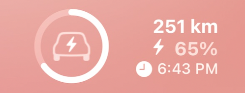
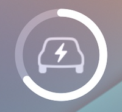

# Widget Support
{: .fs-9 }

Bluelink Scriptable supports two sizes of both Lockscreen and Homescreen widgets. All widgets provide single click access to the main app and all widgets will auto-update in the background.
{: .fs-6 .fw-300 }

It should be noted that there is a optional opt-in setting within the Settings screen called "Enable widget remote refresh" once enabled, the auto-updating of widget data will include sending intermittent remote status commands to the car. This is required to get the latest data from the car directly vs cached data from the Bluelink servers.
{: .fs-5 .fw-300 }

## Home Screen Widgets

These widgets can be added to your homescreen. [See the apple instructions on how to do this](https://support.apple.com/en-ca/118610). These are larger widgets that can display more information and be placed on any homescreen of your choosing.
{: .fs-5 .fw-300 }

<table border="0" class="noBorder">
<tr>
<td width="40%">

</td>
<td>

<b>Medium Size</b>

Will display Car Name (Nick name if set, otherwise Model name) a large car image and  infromation on battery capacity and car range. If car is charging or plugged in - icons will display accordingly and the charging power and expected charge completion time will display. Finally the odometer and the last remote status check date/time will also be visible.

</td>
</tr>
<tr>
<td>

</td>
<td>

<b>Small Size</b>

Will display a small car image and infromation on battery capacity and car range. If car is charging or plugged in - icons will display accordingly and the charging power and expected charge completion time will display. Finally the last remote status check date/time will also be visible.

</td>

</tr>
</table>

## Lock Screen Widgets

These widgets can be added to your lockscreen. [See the apple instructions on how to do this](https://support.apple.com/en-ca/118610). These widgets are small, transparent and will match other apple lockscreen widgets (weather etc).
{: .fs-5 .fw-300 }

<table border="0" class="noBorder">
<tr>
<td width="40%">

</td>
<td>

<b>Large Size</b>

Will display "battery circle" to reflect battery capacity. Plus display available range, exact percentage of battery capacity and, if charging, when charging will complete.

Note the car image will change detect if charging or not.

</td>
</tr>
<tr>
<td>

</td>
<td>

<b>Small Size</b>

Will display just the "battery circle" to reflect battery capacity.

Note the car image will change detect if charging or not.

</td>

</tr>
</table>

----
